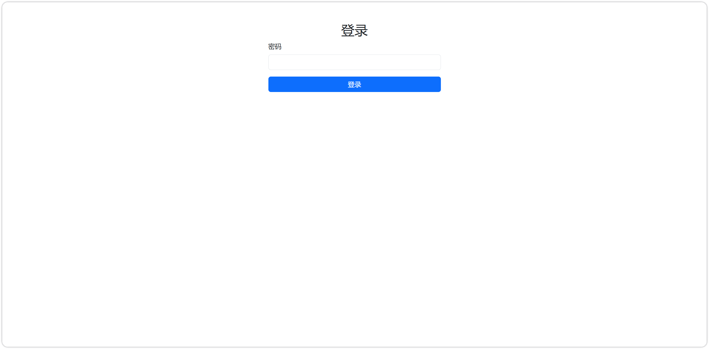
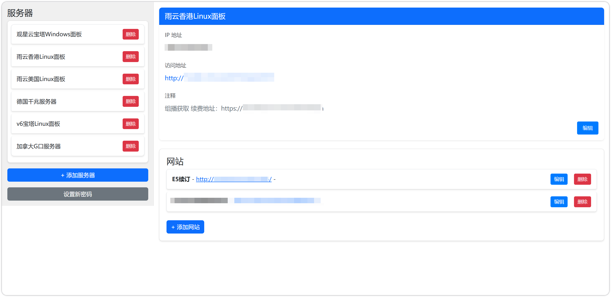
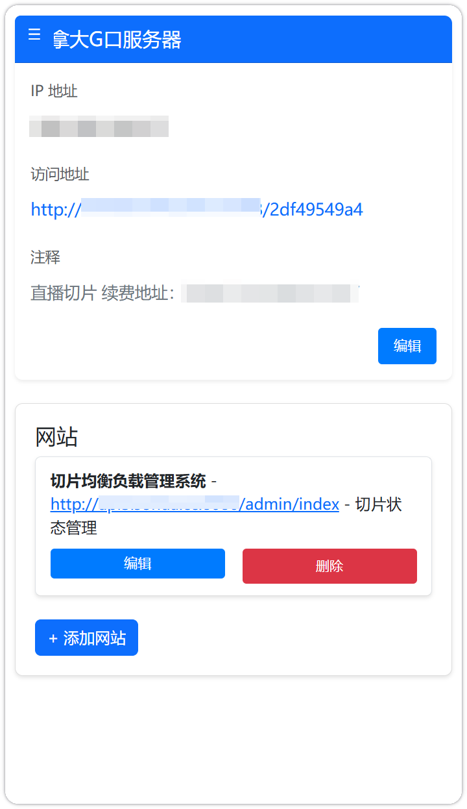
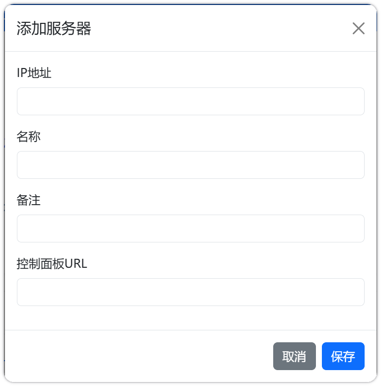
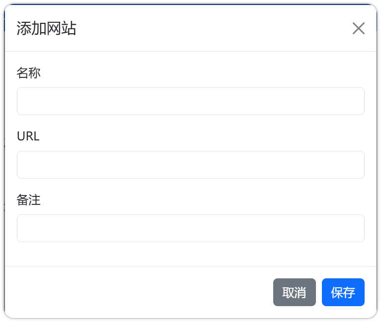

# 服务器统一管理

## 项目简介

该项目的起源是因为服务器和搭载的服务太多，每次都需要登录服务器，然后再登录服务，因此开发了一个小程序，方便管理服务器和服务。

## 功能特性

- 用户登录验证
- 添加、编辑、删除服务器
- 添加、编辑、删除网站
- 更新用户密码

## 文件结构

```
serversinfo/
├── data/
│   ├── info.json
│   ├── passwords.json
│   └── favicon.png
├── css/
│   └── style.css
├── img/
│   └── （项目截图）
├── js/
│   └── script.js
├── save_data.php
├── index.php
├── get_website_list.php
├── get_server_info.php
├── delete_item.php
└── update_password.php
```

## 安装与配置

1. 克隆或下载该项目到本地服务器目录。
2. 确保服务器安装PHP，并配置好相应的环境。
3. 在 `data` 目录下创建 `info.json` 和 `passwords.json` 文件，并初始化内容：
   - `info.json`:
     ```json
     {}
     ```
   - `passwords.json`:
     ```json
     {
       "password_hash": ""
     }
     ```
4. 使用PHP的 `password_hash` 函数生成一个初始密码的哈希值，并将其填入 `passwords.json` 文件中的 `password_hash` 字段，当前是随机填写的，请自行生成。

## 使用说明

### 用户登录

1. 打开浏览器，访问项目的 `index.php` 页面。
2. 输入预设的密码进行登录。

### 管理服务器

1. 登录成功后，点击左侧的“添加服务器”按钮，填写服务器信息并保存。
2. 点击服务器名称可以查看详细信息，并进行编辑或删除操作。

### 管理网站

1. 在服务器详细信息页面，点击“添加网站”按钮，填写网站信息并保存。
2. 点击网站名称可以进行编辑或删除操作。

### 更新密码

1. 点击左侧的“设置新密码”按钮，输入新密码并保存。

## 截图







## 开源代码

该项目使用了以下开源代码：

- [Bootstrap](https://getbootstrap.com/)
- [jQuery](https://jquery.com/)

## 许可证

该项目采用 MIT 许可证，详情请参阅 LICENSE 文件。